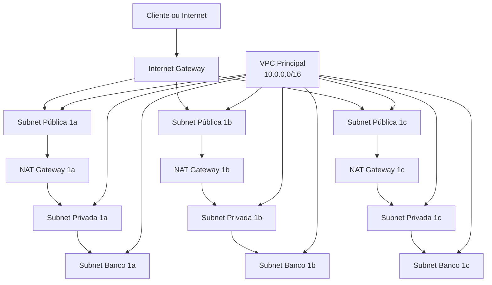

# linuxtips-containers-vpc

Provisionamento de uma VPC na AWS com Terraform para o curso de containers e infraestrutura da LinuxTips.

## Visão geral

Este repositório define a infraestrutura necessária para criar uma VPC com:

- 1 VPC principal com DNS habilitado
- 3 subnets públicas
- 3 subnets privadas
- 3 subnets para bancos de dados
- 1 Internet Gateway
- 3 NAT Gateways com Elastic IPs
- Tabelas de rota e associações por zona de disponibilidade
- Parâmetros no AWS Systems Manager Parameter Store

A arquitetura foi pensada para suportar ambientes de aplicação com separação entre camadas públicas e privadas.

## Diagrama da infraestrutura



## Arquitetura provisionada

A infraestrutura criada inclui:

- VPC com CIDR 10.0.0.0/16
- Subnets públicas nas CIDRs:
  - 10.0.48.0/24
  - 10.0.49.0/24
  - 10.0.50.0/24
- Subnets privadas nas CIDRs:
  - 10.0.0.0/20
  - 10.0.16.0/20
  - 10.0.32.0/20
- Subnets para bancos de dados nas CIDRs:
  - 10.0.51.0/24
  - 10.0.52.0/24
  - 10.0.53.0/24
- Rota padrão 0.0.0.0/0 para internet nas subnets públicas
- Rota padrão 0.0.0.0/0 via NAT nas subnets privadas

## Pré-requisitos

Antes de executar este projeto, certifique-se de ter:

- Terraform instalado
- Credenciais da AWS configuradas localmente
- Permissões adequadas para criar VPC, subnets, gateways, NAT, EIPs e SSM Parameters
- Um bucket S3 para armazenar o state remoto do Terraform

## Estrutura do repositório

- [backend.tf](backend.tf): configuração do backend remoto do Terraform
- [vpc.tf](vpc.tf): definição da VPC principal
- [public_subnets.tf](public_subnets.tf): subnets públicas, rotas e associações
- [private_subnets.tf](private_subnets.tf): subnets privadas, rotas e associações
- [databases_subnets.tf](databases_subnets.tf): subnets para bancos de dados
- [internet_gateway.tf](internet_gateway.tf): Internet Gateway
- [net_gateway.tf](net_gateway.tf): Elastic IPs e NAT Gateways
- [parameters_store.tf](parameters_store.tf): parâmetros salvos no SSM
- [output.tf](output.tf): outputs do módulo
- [variables.tf](variables.tf): variáveis compartilhadas
- [environment/dev](environment/dev): arquivos de configuração para o ambiente de desenvolvimento

## Variáveis

| Nome | Descrição | Tipo | Padrão |
| --- | --- | --- | --- |
| project_name | Nome do projeto usado nos recursos | string | linuxtips-vpc |
| region | Região da AWS onde os recursos serão criados | string | us-east-2 |

## Outputs

O projeto expõe os seguintes outputs:

- ssm_vpc_id
- ssm_private_subnet_1a
- ssm_private_subnet_1b
- ssm_private_subnet_1c
- ssm_public_subnet_1a
- ssm_public_subnet_1b
- ssm_public_subnet_1c
- ssm_databases_subnet_1a
- ssm_databases_subnet_1b
- ssm_databases_subnet_1c

## Como usar

1. Configure as credenciais da AWS.
2. Ajuste os valores de ambiente em [environment/dev/terraform.tfvars](environment/dev/terraform.tfvars).
3. Ajuste o backend remoto em [environment/dev/backend.tfvars](environment/dev/backend.tfvars).
4. Inicialize o Terraform:

```bash
terraform init -backend-config=environment/dev/backend.tfvars
```

5. Planeje a execução:

```bash
terraform plan -var-file=environment/dev/terraform.tfvars
```

6. Aplique a infraestrutura:

```bash
terraform apply -var-file=environment/dev/terraform.tfvars
```

## Backend remoto

O estado do Terraform é armazenado em um bucket S3. O nome do bucket, chave e região são definidos no arquivo [environment/dev/backend.tfvars](environment/dev/backend.tfvars).

## Ambientes

O repositório já contém a estrutura para ambientes de desenvolvimento, homologação e produção em [environment](environment). No momento, o exemplo principal está configurado para o ambiente de desenvolvimento.

## Observações

- Este projeto é voltado para fins de laboratório e aprendizado.
- Para uso em produção, recomenda-se revisar políticas de acesso, tagging, segurança e redundância.
- O backend remoto deve ser configurado corretamente antes de aplicar alterações.
